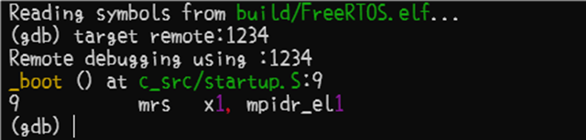
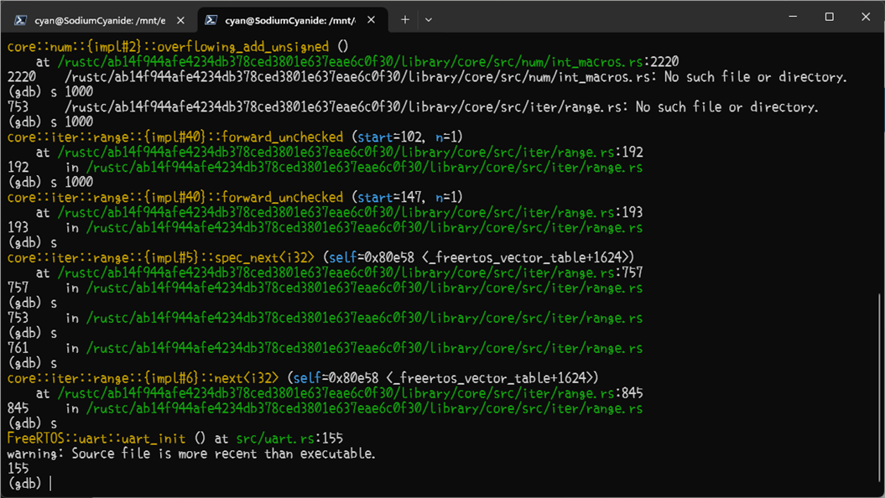
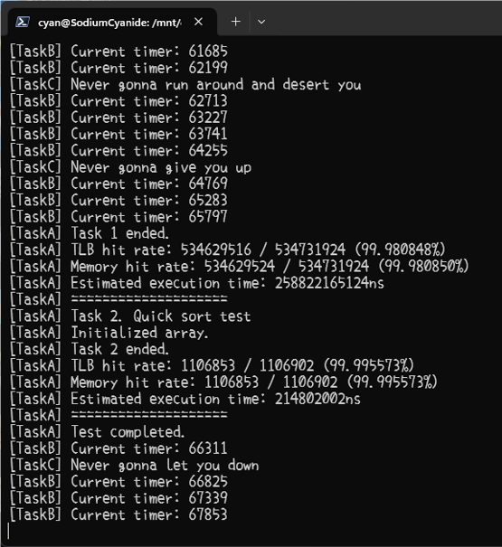

# mustrust小组期末汇报
- [mustrust小组期末汇报](#mustrust小组期末汇报)
  - [引言](#引言)
    - [项目背景](#项目背景)
      - [FreeRTOS](#freertos)
      - [Rust](#rust)
    - [小组分工](#小组分工)
    - [项目成果概述](#项目成果概述)
      - [实现的功能](#实现的功能)
      - [同类项目对比](#同类项目对比)
  - [Rust改写](#rust改写)
    - [原始FreeRTOS分析](#原始freertos分析)
    - [基本方法与原则](#基本方法与原则)
    - [遇到的困难与解决方案](#遇到的困难与解决方案)
      - [Rust与C的相互调用](#rust与c的相互调用)
      - [所有权机制](#所有权机制)
      - [const常量重复定义](#const常量重复定义)
      - [具有函数功能的宏被bindgen忽略](#具有函数功能的宏被bindgen忽略)
      - [适配上板——no-std环境](#适配上板no-std环境)
    - [关键模块](#关键模块)
      - [list模块](#list模块)
      - [task模块](#task模块)
  - [MMU部分](#mmu部分)
    - [关键函数](#关键函数)
    - [模拟结果](#模拟结果)
  - [交叉编译与上板](#交叉编译与上板)
    - [bindgen方案](#bindgen方案)
    - [链接](#链接)
    - [QEMU模拟与调试](#qemu模拟与调试)
    - [整体测试结果](#整体测试结果)
  - [总结](#总结)
    - [项目成果回顾](#项目成果回顾)
    - [未来工作展望](#未来工作展望)


## 引言

### 项目背景

#### FreeRTOS

FreeRTOS是一个广泛使用的实时操作系统(RTOS)，专为嵌入式系统设计，由Richard Barry于2003年首次发布并持续维护。FreeRTOS以其简洁、高效、可裁剪的特点，在全球范围内获得了广泛的认可和应用，其优点包括但不限于以下几点：

* **流行性**：FreeRTOS是最主流的嵌入式操作系统之一，在全球范围内被广泛采用，拥有庞大的社区支持和活跃的生态系统。

* **功能丰富**：FreeRTOS提供了丰富的功能，如任务管理、内存管理、同步机制等，同时还支持文件系统，满足了嵌入式系统的各种需求。

* **性能优异**：FreeRTOS实时性能出色，能够满足嵌入式系统的实时性需求。

* **源代码质量**：FreeRTOS代码精简、可读性强，易于移植到各种嵌入式平台，对开发者友好。

* **版权“友好”**：FreeRTOS的许可证商业友好，允许商业应用和修改，没有版权的后顾之忧。

#### Rust

Rust 是一门系统级别的编程语言，它旨在解决C/C++等语言在系统级编程中常见的安全性和并发性等问题。

传统的系统级编程语言（如C/C++等）在处理内存安全性和并发性时面对着诸多挑战，如空指针、越界访问和数据竞争等。而Rust的设计目标之一就是通过强大的类型系统和所有权机制解决上述的这些问题，提高代码的安全性和可靠性。

Rust的优点包括但不限于以下几点：

* **内存安全性**：Rust通过所有权系统、借用检查器和生命周期管理等机制，确保在编译时避免内存安全问题，如空指针、越界访问、数据竞争等

* **并发性**：Rust内置了轻量级的线程模型和消息传递机制，使并发编程更加容易和安全	

* **性能**：Rust的性能与C/C++相当，甚至在某些情况下更好。它通过零成本抽象和内联优化等技术实现高性能。

* **模式匹配**：Rust拥有强大的模式匹配功能，可用于处理复杂的数据结构和状态转换，使代码更加清晰和可维护。

* **生态系统**：Rust拥有活跃的社区和丰富的库，可以轻松地与其他语言进行集成，并提供各种功能强大的工具和框架，如Cargo构建系统等。

**Rust语言特性对我们项目开发的启发和要求**：

* 所有权机制

  Rust确保了内存安全，防止了缓冲区溢出、越界访问等常见的内存错误 => 要求我们在编写代码时必须仔细思考内存的使用和分配，防止代码中出现未预料到的更改从而影响代码的正确性和安全性。

* 生命周期管理与借用规则

  Rust提供了丰富的生命周期管理功能和借用规则 => 要求我们在编写代码时必须考虑数据的有效期和访问权限，提升代码的安全性，增强软件的可维护性和可读性。

* 类型安全与借用检测器

  Rust的借用检查器保证了代码的类型安全，能够在编译时期就发现潜在的类型错误 => 要求我们在编写代码时必须严格遵守类型规则，确保数据类型的正确匹配，以避免程序在运行时期的类型错误。

### 项目成果概述

#### 实现的功能

* Rust版本的FreeRTOS系统顺利在QEMU上运行
* MMU功能顺利实现

#### 同类项目对比


## Rust改写

### 原始FreeRTOS分析

FreeRTOS的基本架构如下图


我们改写的代码为**基础内核**代码

源码位于本项目的`src/FreeRTOS/c_src`目录下，其主要结构如下图所示


主要文件介绍如下：

**主目录下**
- **FreeRTOS_asm_vector.S：** 汇编文件，用于定义异常向量和中断处理程序。
- **list.c：** 包含了链表数据结构的实现，用于FreeRTOS中的任务管理和内存管理。
- **mmu.c：** 我们自己添加的c语言版的freeRTOS的MMU实现，用于可行性验证。
- **queue.c：** 包含了队列数据结构的实现，用于FreeRTOS中的任务间通信和同步。
- **startup.S：** 汇编文件，用于系统启动时的初始化和配置。
- **tasks.c：** 包含了任务管理的实现，用于创建、删除和管理任务。
- **timers.c：** 包含了定时器管理的实现，用于任务的延时和超时操作。
- **wrapper.c：** include 所有头文件，结合bindgen进行链接。

**`portable/GCC/ARM_CA53_64_RaspberryPi3/`目录下**
- **port.c：** 包含了与Raspberry Pi 3平台相关的端口层实现。
- **portASM.S：** 汇编文件，用于平台相关的底层操作。
- **portmacro.h：** 头文件，包含了与平台相关的宏定义和类型定义。

**`portable/MemMang/`目录下**
- **MemMang/heap_1.c：** 包含了一个简单的堆内存管理器的实现。


### 基本方法与原则

**基本方法**：将源码的函数进行拆分为各种简单的函数或方法，然后整合

**改写原则**：

* 保留源码中的所有函数，函数的命名相应的改为符合Rust命名规范的版本，如`vInitialiseList`改为`initialize_list`
* 渐进式“换血”：重写核心模块 -> 封装原有C源码 -> 测试验证 -> 逐步替换 -> 性能优化

### 遇到的困难与解决方案

#### Rust与C的相互调用

##### Rust调用C代码的基本操作

注意：阅读此小节，我们默认你已经初步掌握了rust编译工具链的相关知识。如果你对`build.rs`,`cargo`,`cargo.toml`,`rustc`等名词还不太熟悉，请你首先阅读相关的知识。

Rust 可以通过**外部函数接口调用**（Foreign Function Interface, **FFI**）来调用 C 代码。FFI 是一种通用的机制，可以使不同语言之间的函数相互调用。在 Rust 中，使用 FFI 机制可以调用 C 语言编写的库。 我们用下面的例子来解释Rust 通过调用 C 代码的步骤：(参考博客链接：[rust调用C代码](https://vincebye.github.io/posts/rust%E8%B0%83%E7%94%A8c%E4%BB%A3%E7%A0%81/#))

```C
// C 代码
#include <stdio.h>

void c_hello(const char* name) {
    printf("Hello, %s!\n", name);
}
```

这是一段简单的C语言代码，定义了一个名为`c_hello`的函数，它接受一个参数`name`，类型为`char*`。

1. **在 Rust 代码中声明 C 函数签名：**
```rust
extern "C" {
    fn c_hello(name: *const c_char);
}
```
在 Rust 代码中声明一个函数签名，其参数和返回值应该与 C 代码中的函数签名一致。这个函数签名可以使用 extern "C" 关键字进行声明，这样 Rust 就可以使用 C 语言的调用约定来调用这个函数。

2. **使用 Rust 绑定链接 C 库：**
```rust
extern crate libc;
use libc::c_char;
```
在 Rust 代码中使用`extern crate`或 `use`关键字来引用 C 库的 Rust 绑定，使得 Rust 可以访问 C 库中的函数和类型定义。

具体而言，第一行`extern crate libc;`是Rust的语法，用于声明外部的crate（在Rust中，crate是一个包或库的概念）。这里的`libc`是一个crate，它提供了对C语言标准库的绑定，使得Rust代码能够使用C标准库中定义的函数和类型。通过这种方式，Rust程序可以调用C语言编写的代码，这在需要使用操作系统API或者与其他用C语言编写的库交互时非常有用。

第二行`use libc::c_char;`是将`libc`库中的`c_char`类型引入当前作用域。在C语言中，`char`类型通常用于表示单个字符。Rust语言自身也有字符类型，但是当与C语言代码交互时，使用`libc`中定义的`c_char`类型可以确保类型的兼容性和正确性。`c_char`类型在不同的平台上可能有不同的定义，比如在某些平台上它是有符号的，而在其他平台上则是无符号的。使用`libc`中的`c_char`可以帮助Rust代码更好地在不同平台间移植。

**在改写的实践中，不同的类型对应着不同的转换方式，对于需要的类型，需要广泛查阅资料进行尝试。**

3. **在 Rust 代码中调用 C 函数：**
```rust
fn main() {
    let name = "World".as_ptr() as *const c_char;
    unsafe {
        c_hello(name);
    }
}
```
在 Rust 代码中使用声明的 C 函数签名来调用 C 函数。在调用之前，需要使用 unsafe 关键字将代码块标记为不安全的，因为在调用 C 函数时，Rust 编译器无法保证代码的安全性。

在代码中，`fn main()`定义了Rust程序的入口点。在这个函数内部，首先声明了一个名为`name`的变量，它的值是字符串`"World"`。`"World".as_ptr()`将Rust字符串转换为一个指针。这个指针随后被转换为`*const c_char`类型，这是一个指向常量C字符的指针，与C语言中的`const char*`类型兼容。这一步是必要的，因为C语言函数`void c_hello(const char* name)`预计会接收一个C字符串作为参数。

4. **将 C 代码编译成 Rust 可以链接的静态库或动态库**:
```rust
//build.rs
extern crate cc;
fn main() {
   cc::Build::new().file("src/harness.c").compile("harness.a");

}
```

由于 Rust 代码和 C 代码使用的编译器和链接器可能不同，需要通过编译成中间格式的静态库或动态库来进行链接。在 Rust 中，可以使用 `cc crate` 来编译 C 代码并生成静态库或动态库。在上述代码中，`cc::Build::new().file("src/harness.c").compile("harness.a")` 的作用是使用 `cc crate` 编译 `src/harness.c` 文件，并将生成的静态库命名为 `harness.a`。需要注意的是，生成的静态库或动态库的命名和文件格式可能会因操作系统和编译器的不同而有所区别。例如，在 Windows 系统上，静态库的命名通常是 `libharness.a`，而动态库的命名通常是 `harness.dll`。生成静态库或动态库后，就可以使用 Rust 的 `#[link(name = "library_name")]` 属性来链接库文件并在 Rust 代码中调用 C 函数了。

最后，要记得在`cargo.toml`文件中引入项目依赖
```toml
[dependencies]
libc = "0.2"
[build-dependencies]
cc = "1.0"
```

如果没有在 Rust 代码中使用 `#[link(name = "library_name")]` 属性来指定链接的库的名称，Rust 编译器会**默认**按照一定的规则搜索系统默认的库文件路径来查找库文件。具体来说，Rust 编译器会按照以下顺序搜索库文件：
1. **在系统默认的库搜索路径中查找：** 
Rust 编译器会搜索系统默认的库文件路径，例如 `/usr/lib` 和 `/usr/local/lib` 等目录。
2. **在 Rust 代码所在的目录中查找：** 
如果 Rust 代码和库文件在同一个目录中，Rust 编译器会在该目录中查找库文件。
3. **在指定的搜索路径中查找：** 
如果在编译 Rust 代码时使用了 -L 参数指定了库文件搜索路径，Rust 编译器会在这些路径中查找库文件

最后，我们得到的完整文件如下：
```c
// src/harness.c
#include <stdio.h>

void c_hello(const char* name) {
    printf("Hello, %s!\n", name);
}
```
```rust
// Rust 代码
#[link(name = "harness.a")]
extern crate libc;
use libc::c_char;
// 声明 C 函数签名
extern "C" {
    fn c_hello(name: *const c_char);
}
fn main() {
    let name = "World".as_ptr() as *const c_char;
    unsafe {
        c_hello(name);
    }
}
```
```rust
//build.rs
extern crate cc;
fn main() {
   cc::Build::new().file("src/harness.c").compile("harness.a");
}
```
```toml
//Cargo.toml
[package]
name = "c_code_with_fork_executor"
version = "0.0.1"
edition = "2021"

[dependencies]
libc = "0.2"
[build-dependencies]
cc = "1.0"
```

##### Rust调用C代码的进阶操作——bindgen的使用

在Rust编程中需要与C语言库进行交互时,bindgen是一个非常有用的工具。它的主要功能是自动生成Rust的外部函数接口（FFI）代码，这使得Rust程序能够调用C语言库中的函数并使用其类型。bindgen作为一个桥梁，自动化了Rust与C语言之间的接口生成过程，极大地简化了在Rust代码中使用C语言库的复杂性。

例如，对于C头文件`cool.h`:
```c
typedef struct CoolStruct {
    int x;
    int y;
} CoolStruct;

void cool_function(int i, char c, CoolStruct* cs);
```

bindgen会扫描`cool.h`，并为其中定义的每个函数和类型生成相应的Rust代码。
```rust
/* automatically generated by rust-bindgen 0.99.9 */

#[repr(C)]
pub struct CoolStruct {
    pub x: ::std::os::raw::c_int,
    pub y: ::std::os::raw::c_int,
}

extern "C" {
    pub fn cool_function(i: ::std::os::raw::c_int,
                         c: ::std::os::raw::c_char,
                         cs: *mut CoolStruct);
}
```
你可以轻松地在Rust项目中调用这个库的函数和使用其类型，就好像它们是原生Rust代码一样。

具体使用方法参考文档:[Bindgen官方文档](https://rust-lang.github.io/rust-bindgen/introduction.html)

在我们的项目中，我们最终采用 `wrapper.c` include 所有头文件，再对这一 c 文件采用bindgen的命令行工具进行 bindgen，得到干净的 `bind.rs`便于后续使用。

#### 所有权机制

**问题**：所有权问题在链表中尤为突出，因为链表中的链表项可能会在多个地方被使用，它们在使用完后会被释放，而这会导致链表项的生命周期提前结束。

**解决方案**：使用数据结构Arc将数据包裹，它能够统计程序的不同地方对某个变量的引用，并且进行计数。只要存在这样的引用，程序就不会自动释放这个变量，从而确保了变量的有效性。

**但是**，使用Arc包裹数据又会产生新的问题——**循环引用**，例如A引用B，B引用A，那么A，B就永远无法被释放！

**最终解决方案**：再引入弱引用Weak，它不会增加引用数。同时，利用Rust的upgrade和downgrade函数可以实现强引用Arc和弱引用Weak之间的转换，合理增减变量的引用数。

#### const常量重复定义

**问题**：编译时报错头文件中的const常量重复定义，如下图。


**解决方案**：将重复定义的const常量改成宏定义的形式，如下图：


#### 具有函数功能的宏被bindgen忽略

**问题**：在使用bindgen时，头文件中的一部分具有函数功能的宏会被忽略。

**解决方案**：

**方案一**：专门写一个函数来扫描所有头文件，将具有函数功能的宏以macro的形式追加到bindgen末尾。

**方案二**：手动将所有具有函数功能的宏修改为具有相同名称和功能的函数。

由于这样的宏并不是很多，所以我们选择了**方案二**，下面就是一个修改宏的例子：


#### 适配上板——no-std环境

**问题**：上板时为`no-std`环境，这意味着不支持`std`库，而我们的代码中大量使用了`std`库的功能。

**解决方案**：使用`no-std`环境支持的库如`core`，`alloc`等来替代`std`：

`core`：核心库，提供Rust语言的基础设施，如基础数据类型、操作符、宏等。

`alloc`：提供动态内存分配的支持。

`no_std_async`：专为no-std环境设计的异步库，旨在提供不依赖标准库的情况下使用异步编程的能力。

在代码的具体实现中，我们做了以下替换：

```rust
std::sync => alloc::sync
std::fmt => core::fmt
std::cell::UnsafeCell => core::cell::UnsafeCell
std::collections::VecDeque => alloc::collections::VecDeque
std::boxed => alloc::boxed
std::mem => core::mem
std::sync::RwLock => synctools::rwlock
```

此外，在实现某些功能时，还引入了诸如`core::marker::PhantomData`等no-std环境的库中的内容。

### 关键模块

#### list模块

##### list介绍

在`FreeRTOS`中，List是一个双向链表，其主要任务是辅助任务调度。

在`list.h`中，每个链表`xList`由链表项`xList_Item`，链表项个数，链表的结束标记和用于进行数据完整性检查的两个条件编译字段组成，其结构体定义如下：

```c
typedef struct xLIST
{
	listFIRST_LIST_INTEGRITY_CHECK_VALUE
	volatile UBaseType_t uxNumberOfItems;
	ListItem_t * configLIST_VOLATILE pxIndex
	MiniListItem_t xListEnd;
	listSECOND_LIST_INTEGRITY_CHECK_VALUE
} List_t;
```

链表项`xListItem`由节点值，指向前后结点的指针，指向拥有当前链表节点的对象的指针（通常，这个对象是一个任务控制块`TCB`），指向包含当前链表节点的链表的指针和用于进行数据完整性检查的两个条件编译字段组成，其结构体定义如下：

```c
struct xLIST_ITEM
{
	listFIRST_LIST_ITEM_INTEGRITY_CHECK_VALUE
	configLIST_VOLATILE TickType_t xItemValue;
	struct xLIST_ITEM * configLIST_VOLATILE pxNext;
	struct xLIST_ITEM * configLIST_VOLATILE pxPrevious;
	void * pvOwner;
	void * configLIST_VOLATILE pvContainer;
	listSECOND_LIST_ITEM_INTEGRITY_CHECK_VALUE
};
```

##### Rust改写方式

前面已经提到过，Rust 语言的所有权机制，给实现 List 带来了问题——链表中的链表项可能会在多个地方被使用，它们在使用完后会被释放，而这会导致链表项的生命周期提前结束。一个解决方案是使用数据结构Arc将数据包裹，它能够统计程序的不同地方对某个变量的引用，并且进行计数。只要存在这样的引用，程序就不会自动释放这个变量，从而确保了变量的有效性。

但是使用Arc包裹数据又会产**循环引用**的问题，例如A引用B，B引用A，那么A，B就永远无法被释放！

最终的解决方案为再引入弱引用Weak，它不会增加引用数。同时，利用Rust的upgrade和downgrade函数可以实现强引用Arc和弱引用Weak之间的转换，合理增减变量的引用数。

Rust版本的链表项和链表的数据结构如下：

```rust
pub struct xLIST_ITEM
{
	xItemValue: TickType,	// 辅助值，用于帮助结点做顺序排列
	
	pxNext: WeakItemLink,	// 双向引用
	pxPrevious: WeakItemLink,	// 双向引用
    pvOwner: Weak<RwLock<TaskControlBlock>>,	// 指向拥有该结点的内核对象
    pvContainer: Weak<RwLock<List_t>>,	// 指向该节点所在的链表 双向引用
}

pub struct xLIST
{
    uxNumberOfItems: UBaseType,	// 链表节点计数器
	pxIndex: WeakItemLink,	// 链表节点索引指针			
    xListEnd: ItemLink,	// 链表最后一个节点 单向引用					
}
```

然后，我们采取将源码的函数进行拆分为各种简单的函数或方法，然后整合的方式来实现`list`模块的功能：

1. `xLIST_ITEM::default`：`xLIST_ITEM`结构体的默认构造函数，用于初始化一个链表项，其中`xItemValue`设置为`portMAX_DELAY`，表示这个项在排序时会被放在链表的最末尾。
2. `xLIST_ITEM::new`：创建一个新的链表项，并设置其`xItemValue`。
3. `xLIST_ITEM::set_value`：设置链表项的`xItemValue`。
4. `xLIST_ITEM::owner`：设置链表项的拥有者，通常是一个任务控制块（`TaskControlBlock`）。
5. `xLIST_ITEM::set_container`：设置链表项所属的容器，即它所在的链表。
6. `xLIST_ITEM::remove`：从链表中移除一个项。
7. `new_list_item`：创建一个新的链表项，并用`Arc<RwLock>`包装，以便在多线程环境中安全访问。
8. `xLIST::default`：初始化一个空的链表，其中包含一个特殊的链表末端项，用于标记链表的结束。
9. `xLIST::traverse`：遍历链表的函数，示例中未完全实现，通常用于访问链表中的每个项。
10. `xLIST::insert`：将一个项插入到链表中，插入位置根据项的`xItemValue`确定，以保持链表的排序。
11. `xLIST::insert_end`：在链表的末尾插入一个项。
12. `xLIST::remove_item`：从链表中移除一个项。
13. `xLIST::is_empty`：检查链表是否为空。
14. `xLIST::get_length`：获取链表的长度，即其中项的数量。
15. `xLIST::increment_index`：移动链表的内部索引指针，用于遍历链表。
16. `xLIST::get_owner_of_next_entry`：获取链表中下一个项的拥有者。
17. `xLIST::get_owner_of_head_entry`：获取链表头部项的拥有者。
18. `set_list_item_next`和`set_list_item_prev`：这两个函数用于设置链表项的`pxNext`和`pxPrevious`指针，分别指向链表中的下一个和上一个项。

完整代码见仓库中的[list.rs](https://github.com/OSH-2024/mustrust/blob/main/src/FreeRTOS/src/list.rs)

然后我们就可以使用这其中的函数或方法来很容易的实现原`list.c`的功能：

* `list_initialise(item: &mut ItemLink)`：直接调用相应的`xList::default()`方法即可。

* `list_initialiseItem(item: &mut ListItem_t)`：直接调用相应的`xList_Item::default()`方法即可。

* `list_insert(list: &ListLink, item_link: &ItemLink)`：首先通过`write`方法获得待插入节点的可变引用，然后调用`set_container`方法将这个节点与其所属的链表关联起来。这个关联对于之后如果需要从链表中快速移除该节点是非常有用的，因为它允许直接定位到节点所在的链表。然后通过`write`方法获得链表的可变引用，最后调用链表的`insert`方法将节点插入到链表中。注意插入时使用的是`Arc::downgrade(&item_link)`以将`item_link`的`Arc`（一个智能指针，用于提供线程安全的引用计数所有权）转换为一个`Weak`指针，避免循环引用。

* `list_insert_end(list: &ListLink, item_link: &ItemLink)`：与`list_insert`类似，不同的是最后调用的是链表的`insert_end`方法将节点插入到链表末尾。
* `list_remove(item_link: ItemLink) -> UBaseType`：首先通过`item_link.write()`调用获取到`item_link`的可变引用。然后调用链表的`remove`方法从链表中移除`item_link`指向的节点。同样需要注意的是，这里使用的是`Arc::downgrade(&item_link)`作为参数，原因同`list_insert`。最后，`remove`方法返回链表中剩余节点的数量，类型为`UBaseType`。

代码如下：

```rust
pub fn list_initialise(item: &mut ItemLink) {
    let ItemLink = xLIST::default();
}

pub fn list_initialiseItem(item: &mut ListItem_t) {
    let ListItem = xLIST_ITEM::default();
}

pub fn list_insert(list: &ListLink, item_link: &ItemLink) {
    item_link.write().set_container(&list);
    list.write().insert(Arc::downgrade(&item_link))
}

pub fn list_insert_end(list: &ListLink, item_link: &ItemLink) {
    item_link.write().set_container(&list);
    list.write().insert_end(Arc::downgrade(&item_link))
}

pub fn list_remove(item_link: ItemLink) -> UBaseType {
    item_link
        .write()
        .remove(Arc::downgrade(&item_link))
}
```


#### task模块

##### 概述
任务模块是操作系统的重要组成部分，负责管理任务的创建、删除和调度。它提供必要的数据结构和功能来处理任务控制块（TCB）、任务优先级、任务状态等相关功能。

##### 任务控制块（TaskControlBlock）
`TaskControlBlock` 结构体保存了每个任务的信息，例如其优先级、名称、堆栈指针和各种任务状态。它包括通过条件编译启用的多个配置选项。

```rust
pub struct TaskControlBlock {
    state_list_item: ItemLink,
    event_list_item: ItemLink,
    priority: UBaseType,
    task_name: String,
    stack_pointer: StackType,
    stack_length: UBaseType,

    #[cfg(feature = "portCRITICAL_NESTING_IN_TCB")]
    critical_nesting: UBaseType,
    #[cfg(feature = "configUSE_MUTEXES")]
    base_priority: UBaseType,
    #[cfg(feature = "configUSE_MUTEXES")]
    mutexed_held: UBaseType,
    #[cfg(feature = "configGENERATE_RUN_TIME_STATS")]
    run_time_counter: TickType,
    #[cfg(feature = "configUSE_TASK_NOTIFICATIONS")]
    notified_value: u32,
    #[cfg(feature = "configUSE_TASK_NOTIFICATIONS")]
    nofity_state: u8,
    #[cfg(feature = "INCLUDE_xTaskAbortDelay")]
    delay_aborted: bool,
}
```
对C语言预处理指令中的条件编译，我们在rust改写中主要使用如上图代码所示的包括 `#[cfg]`、`#[cfg_attr]` 等属性宏来处理。

##### 初始化
`initialize` 方法为任务设置堆栈并为其执行做准备。它为堆栈分配内存，设置堆栈指针，并使用提供的函数初始化堆栈。

```rust
impl TaskControlBlock {
    pub fn initialize<F>(mut self, func: F) -> Result<TaskHandle, FreeRtosError>
    where
        F: FnOnce() -> () + Send + 'static,
    {
        // 堆栈分配和初始化逻辑
    }
}
```

##### 任务句柄（TaskHandle）
`TaskHandle` 结构体是 `Arc<RwLock<TaskControlBlock>>` 的封装，提供对 TCB 的线程安全访问。它包括操作任务优先级、状态和其他属性的方法。

```rust
#[derive(Clone)]
pub struct TaskHandle(Arc<RwLock<TaskControlBlock>>);

impl TaskHandle {
    pub fn get_name(&self) -> String {
        GetTaskControlBlockRead!(self).get_name().to_string()
    }

    pub fn set_priority(&self, priority: UBaseType) {
        GetTaskControlBlockWrite!(self).set_priority(priority);
    }

    // 其他与任务相关的方法
}
```

##### 任务创建和调度
该模块包含将任务添加到就绪列表、管理延迟任务和处理任务删除的函数。这些函数确保任务被正确调度并在不同状态之间转换。

```rust
pub fn add_current_task_to_delayed_list(ticks_to_delay: TickType, can_block_indefinitely: bool) {
    let current_task_handle = get_current_task_handle!();
    // 管理延迟任务的逻辑
}

#[cfg(feature = "INCLUDE_vTaskDelete")]
pub fn task_delete(task_to_delete: TaskHandle) {
    let tcb = GetTaskControlBlockWrite!(task_to_delete);
    // 任务删除逻辑
}
```

##### 任务挂起和恢复
该模块还提供挂起和恢复任务的机制，确保任务可以根据需要暂停和恢复。

```rust
#[cfg(feature = "INCLUDE_vTaskSuspend")]
pub fn is_task_suspended(task: &TaskHandle) -> bool {
    let mut result = false;
    let tcb = GetTaskControlBlockRead!(task);
    // 检查任务是否挂起的逻辑
}
```

##### 任务宏
定义了多个宏来处理任务通知、堆栈填充和其他与任务相关的操作。这些宏提供了执行常见任务操作的方便方法。

```rust
#[macro_export]
macro_rules! taskNOT_WAITING_NOTIFICATION { () => { 0 as u8 } }
#[macro_export]
macro_rules! taskWAITING_NOTIFICATION { () => { 1 as u8 } }
#[macro_export]
macro_rules! taskNOTIFICATION_RECEIVED { () => { 2 as u8 } }
```

##### 总结
任务模块是一个综合组件，管理操作系统中任务的生命周期和调度。它提供必要的结构和功能来创建、删除、挂起、恢复和调度任务，确保高效和可靠的任务管理。


## MMU部分

### 概述
内存管理单元（MMU）模块是操作系统中的关键组件之一，我们通过软件模拟实现，为FreeRTOS实现了一个支持虚拟内存、页表管理、TLB加速以及LRU和FIFO两种页面替换策略的MMU。该模块使用链表维护内存帧的使用情况，并提供了一系列函数来处理内存访问、页面错误等操作。本文将介绍MMU模块的关键函数及其在运行冒泡排序程序时的模拟结果。

### 关键函数

#### 初始化函数
MMU模块的初始化包括列表初始化、统计数据初始化、任务控制块（TCB）初始化等。

```c
void initialize_stat() {
    time_cost = 0;
    TLB_hit = 0;
    TLB_miss = 0;
    memory_hit = 0;
    memory_miss = 0;
}

void initialize_tcb() {
    currentTCB = (TCB*)pvPortMalloc(sizeof(TCB));
    page_table_init(currentTCB);
}

void uninitialize_tcb() {
    vPortFree(currentTCB);
}
```
这些函数用于初始化统计变量、分配TCB内存并初始化页表。`initialize_stat`函数重置所有统计变量。`initialize_tcb`函数分配一个新的TCB并调用`page_table_init`函数初始化页表。`uninitialize_tcb`函数释放当前的TCB内存。

#### 内存读写函数
这些函数用于在内存和磁盘之间进行数据读写操作。

```c
int read_to_memory(int memory_frame, int disk_start_address) {
    int memory_address, disk_address;
    for (int i = 0; i < page_size; i += 2) {
        memory_address = memory_frame * page_size + i;
        disk_address = disk_start_address + i;
        memory[memory_address] = disk[disk_address];
    }
    for (int i = 1; i < page_size; i += 2) {
        memory_address = memory_frame * page_size + i;
        disk_address = disk_start_address + i;
        memory[memory_address] = disk[disk_address];
    }
    time_cost += time_disk_access;
    return 1;
}

int write_to_disk(int memory_frame, int disk_start_address) {
    int memory_address, disk_address;
    for (int i = 0; i < page_size; i += 2) {
        memory_address = memory_frame * page_size + i;
        disk_address = disk_start_address + i;
        disk[disk_address] = memory[memory_address];
    }
    for (int i = 1; i < page_size; i += 2) {
        memory_address = memory_frame * page_size + i;
        disk_address = disk_start_address + i;
        disk[disk_address] = memory[memory_address];
    }
    time_cost += time_disk_access;
    return 1;
}
```
`read_to_memory`函数从磁盘读取数据到内存，`write_to_disk`函数则将数据从内存写入磁盘。这两个函数通过遍历页的所有字节进行读写操作，并累加磁盘访问时间。

#### 地址映射函数
该函数实现虚拟地址到物理地址的映射，并处理TLB命中和缺页中断等情况。

```c
int address_map(int virtual_address, enum memory_operation operation) {
    int page_number = virtual_address / page_size;
    int offset = virtual_address % page_size;
    int physical_address;
#if(1 == useTLB)
    if ((physical_address = TLB_search(virtual_address, operation)) != -1) {
        TLB_hit++;
        memory_hit++;
        return physical_address;
    }
    TLB_miss++;
#endif
    
    time_cost += time_memory_access;
    if (!currentTCB->page_table[page_number].valid) {
        pageFault((currentTCB->page_table) + page_number, page_number);
        memory_miss++;
    } else memory_hit++;
    physical_address = currentTCB->page_table[page_number].frame_number * page_size + offset;
#if(0 == ReplacementStrategy)
    pMovetoFirst(&LRU_list, currentTCB->page_table[page_number].frame_number);
#endif
    if (operation == write) {
        currentTCB->page_table[page_number].dirty = 1;
    }
#if(1 == useTLB)
    TLB_update(page_number, currentTCB->page_table[page_number].frame_number);
#endif
    return physical_address;
}
```
`address_map`函数将虚拟地址映射到物理地址。首先，它检查TLB是否命中，如果命中，则返回物理地址并更新TLB命中次数。否则，检查页表，如果页面不在内存中，则处理缺页中断。最后，返回计算出的物理地址，并根据操作类型更新页面状态和TLB。

#### 缺页处理函数
该函数处理缺页中断，通过页表和TLB更新实现页面替换。

```c
void pageFault(entry * faultPage, int page_number) {
#if(0 == ReplacementStrategy)
    LINKNODE endNode = GetEndNode(LRU_list);
#endif
#if(1 == ReplacementStrategy)
    LINKNODE endNode = FIFO_list;
#endif
#if(1 == useTLB)
    if (endNode->task_belonging == currentTCB) {
        for (int i = 0; i < TLB_size; i++) {
            if (TLB[i].valid == 1 && TLB[i].page_number == endNode->page_number) {
                TLB[i].valid = 0;
                if (TLB[i].dirty == 1) {
                    ((currentTCB->page_table) + (endNode->page_number))->dirty = 1;
                }
                break;
            }
        }
    }
#endif
    
    if (((endNode->task_belonging->page_table) + (endNode->page_number))->dirty == 1) {
        int disk_address_out = ((endNode->task_belonging->page_table) + (endNode->page_number))->disk_address;
        write_to_disk(endNode->frame_number, disk_address_out);
    }
    ((endNode->task_belonging->page_table) + (endNode->page_number))->valid = 0;
    
    int disk_address_in = faultPage->disk_address;
    read_to_memory(endNode->frame_number, disk_address_in);
    faultPage->dirty = 0;
    faultPage->valid = 1;
    faultPage->frame_number = endNode->frame_number;
    
    endNode->task_belonging = currentTCB;
    endNode->page_number = page_number;
#if(1 == ReplacementStrategy)
    FIFO_list = FIFO_list->next;
#endif
}
```
`pageFault`函数处理缺页中断。根据页面替换策略，它选择一个内存帧进行替换。如果替换的帧已修改，则将其写回磁盘。然后从磁盘读取新的页面到内存，并更新页表和TLB。

#### TLB操作函数
这些函数用于在TLB中搜索和更新页面映射。

```c
int TLB_search(int virtual_address, enum memory_operation operation) {
    int page_number = virtual_address / page_size;
    int offset = virtual_address % page_size;
    int physical_address = -1;
    for (int i = 0; i < TLB_size; i++) {
        if (TLB[i].page_number == page_number && TLB[i].valid == 1) {
            TLB[i].ref = 1;
            if (operation == write) {
                TLB[i].dirty = 1;
            }
            physical_address = TLB[i].frame_number * page_size + offset;
            break;
        }
    }
    time_cost += time_TLB_access;
    return physical_address;
}

int TLB_update(int page_number, int frame_number) {
    for (int i = 0; i < TLB_size; i++) {
        if (TLB[i].valid == 0) {
            TLB[i].page_number = page_number;
            TLB[i].frame_number = frame_number;
            TLB[i].dirty = 0;
            TLB[i].ref = 1;
            TLB[i].valid = 1;
            return 1;
        }
    }
    for (int i = 0; i < TLB_size; i++) {
        if (TLB[i].valid == 1 && TLB[i].ref == 1 && i != TLB_size - 1) {
            TLB[i].ref = 0;
        } else {
            if (TLB[i].valid == 1 && TLB[i].dirty == 1) {
                ((currentTCB->page_table) + (TLB[i].page_number))->dirty = 1;
            }
            TLB[i].page_number = page_number;
            TLB[i].frame_number = frame_number;
            TLB[i].dirty = 0;
            TLB[i].ref = 1;
            TLB[i].valid = 1;
            break;
        }
    }
    return 1;
}
```
`TLB_search`函数在TLB中搜索虚拟地址，如果找到匹配的页面，则返回对应的物理地址并更新引用和脏位。`TLB_update`函数在TLB中插入或更新页面映射。如果TLB已满，则根据页面访问情况选择替换策略，并将新的页面映射插入到TLB中。

#### 页面替换策略初始化函数
这些函数用于初始化LRU和FIFO两种页面替换策略的链表。

```c
void LRU_list_init(LINKNODE *list) {
    LINKNODE s;
    pInitList(list);
    for (int i = 0; i < memory_frame_size; i++) {
        s = (LINKNODE)pvPortMalloc(sizeof(NODE));
        s->task_belonging = currentTCB;
        s->page_number = i;
        s->frame_number = i;
        pInsertElem(list, s, 1);
    }
}

void FIFO_list_init(LINKNODE *list) {
    LINKNODE s, p;
    pInitList(list);
    for (int i = 0; i < memory_frame_size; i++) {
        s = (LINKNODE)pvPortMalloc(sizeof(NODE));
        s->task_belonging = currentTCB;
        s->page_number = i;
        s->frame_number = i;
        pInsertElem(list, s, 1);
    }
    p = GetEndNode(*list);
    p->next = (*list)->next;
    *list = (*list)->next;
}
```
`LRU_list_init`函数初始化LRU策略的链表，每个节点代表一个内存帧，并将其插入到链表中。`FIFO_list_init`函数初始化FIFO策略的链表，通过链表头和尾的移动实现FIFO。

#### 其他辅助函数
除了上述关键函数外，还有一些辅助函数用于统计、内存访问、缓存访问时间等。

```c
void initialize_list() {
    #if ReplacementStrategy == 0
    LRU_list_init(&LRU_list);
    #elif ReplacementStrategy == 1
    FIFO_list_init(&FIFO_list);
    #endif
}

int read_memory(int virtual_address) {
    int physical_address = address_map(virtual_address, read);
    int data = memory[physical_address];
    time_cost += time_cach_access;
    return data;
}

void write_memory(int virtual_address, int data) {
    int physical_address = address_map(virtual_address, write);
    memory[physical_address] = data;
    time_cost += time_cach_access;
}

void write_back() {
    for (int i = 0; i < TLB_size; i++) {
        if (TLB[i].valid == 1 && TLB[i].dirty == 1) {
            ((currentTCB->page_table) + (TLB[i].page_number))->dirty = 1;
        }
    }
    
    for (int i = 0; i < memory_frame_size; i++) {
        if (((currentTCB->page_table) + i)->valid == 1 && ((currentTCB->page_table) + i)->dirty == 1) {
            write_to_disk(((currentTCB->page_table) + i)->frame_number, ((currentTCB->page_table) + i)->disk_address);
        }
    }
}
```
`initialize_list`函数根据选择的替换策略初始化链表。`read_memory`和`write_memory`函数分别实现内存读和写操作，并更新访问时间。`write_back`函数将TLB和内存中已修改的页面写回磁盘。

### 模拟结果
以上函数和数据结构共同工作，模拟了内存访问、页面替换和TLB加速的效果。通过运行冒泡排序程序，并统计访存时间，验证了MMU模块在各种情况下的性能表现和正确性。

我们实现的MMU取得了非常好的效果。在快速排序等程序的测试下，命中率均在99.9%以上！

## 交叉编译与上板

### bindgen方案

Rust 的 bindgen 工具只能支持单个问题，如果需要对含有多个文件的项目进行 bindgen 并交叉调用，则需要单独写一个 `wrapper.c` 文件，其包含所有需要用到的头文件：

``` c
#include <stddef.h>
#include "FreeRTOS.h"
#include "list.h"
#include "mmu.h"
#include "queue.h"
#include "semphr.h"
#include "task.h"
#include "timers.h"
#include "portmacro.h"
```

对 `wrapper.c` 进行 bindgen，即可得到干净的 `bindings.rs`，即对原代码中调用的库（如 `stdio.h` 等），`bindings.rs` 中不会生成其中的函数。

### 链接

由于需要兼容上板，我们需要使用专门的编译器 `aarch64-none-elf-gcc` 进行链接以获得可以上板运行的操作系统内核文件。在安装完这个编译器后，为了让 Rust 能够使用该编译器进行链接，需要在 Cargo 的配置文件 `~/.cargo/config` 中加入以下两行代码：

``` ini
[target.aarch64-unknown-none]
linker = "aarch64-none-elf-gcc"
```

同时我们也需要在 `build.rs` 中加入以下几行，以使用 `raspberrypi3.ld` 中定义的参数进行链接，并最终输出到 `build/FreeRTOS.elf`：

```rust
println!("cargo:rustc-link-arg-bins=-T");
println!("cargo:rustc-link-arg-bins=raspberrypi3.ld");
println!("cargo:rustc-link-arg-bins=-o");
println!("cargo:rustc-link-arg-bins=build/FreeRTOS.elf");
```

整个过程配置完成后，进行编译，编译成功后即可生成操作系统内核文件 `FreeRTOS.elf`。

### QEMU模拟与调试

要运行生成出来的内核文件，需要使用以下参数启动 QEMU：

```sh
qemu-system-aarch64 -M raspi3b -m 1024M -serial null -serial mon:stdio -nographic -kernel build/FreeRTOS.elf
```

其中 `-M raspi3b` 表示在 RaspberryPi 3B 即树莓派 3B 的环境下运行，`-m 1024M` 表示设置内存大小为 1024M。运行该命令，如果一切正常，即可在命令行中看到每个任务的输出。

在测试的过程中，经常会出现程序遇到 panic，此时 QEMU 会宕机，并不产生任何输出，且由于运行于内核环境，难以通过输出中间值的方式对程序进行调试，所以这里就需要用到 `gdb-multiarch` 工具进行调试。

该工具的使用方法如下：

+ 首先使用调试模式运行 QEMU，命令如下：

  ```sh
  qemu-system-aarch64 -M raspi3b -m 1024M -serial null -serial mon:stdio -nographic -kernel build/FreeRTOS.elf –s –S
  ```

  该命令相比于之前的命令，多出了一个 `-s` 和一个 `-S`，其中 `-s` 代表为 gdb 打开 1234 端口，相当于 `-gdb tcp::1234`，`-S` 代表在开始运行后冻结 CPU，并等待 gdb 发出的指令。

+ 开始运行后，端口 1234 会被打开供 gdb 访问，此时运行 `gdb-multiarch build/FreeRTOS.elf`，令 gdb 打开这个待调试的内核文件，进入 gdb 后，输入 `target remote:1234` 即可启动调试。效果如下：

  

进入调试后，下面要做的就是定位到具体出错的位置。在 gdb 中有一个指令为 `s`，即单步执行指令。单独输入一个 `s` 可以让程序往后执行一步，输入 `s` 加步数可以让程序往后执行指定步，例如 `s 100` 可以让程序往后执行 100 步。当程序执行到出错的地方并进入 panic 时，gdb 会提示“无法找到函数的结尾”，于是便可以利用这条信息确定程序已经出错。下面给出一种定位程序错误位置的方式：

+ 首先根据程序出错时已有的输出，初步判断程序在哪里出错；
+ 估算一个步数，并使用 `s` 加上这个步数进行执行；
+ 如果此时已经进入错误的位置，则适当减少估算的步数，从头开始；
+ 如果还未进入错误的位置，则继续估算剩余的步数并执行。

不断进行以上的操作，即可找到程序执行多少步后会出现问题，从而定位到错误的一行代码进行修改。



### 整体测试结果

为了验证操作系统的有效性，我们编写并执行了以下的测试任务：

#### 测试方案

1. **MMU的测试程序 (TaskA)**：
   - 通过模拟内存管理单元 (MMU) 的行为，测试了系统对内存地址转换和虚拟内存的支持情况。
   - 测试了TLB（Translation Lookaside Buffer）的命中率和内存访问命中率。

2. **计时器程序 (TaskB)**：
   - 通过定时器的输出，验证了操作系统在时间管理和任务调度方面的稳定性和准确性。

3. **循环输出歌词的程序 (TaskC)**：
   - 反复输出歌曲 ***"Never Gonna Give You Up"*** 的副歌部分，测试了系统在处理重复任务和字符串操作上的表现。

4. **计算π的前10,000位的程序 (TaskD)**：
   - 进行了高精度的数学计算，测试了操作系统在执行复杂计算任务时的效率和准确性。

此外，我们采用了上节中提到的交叉编译和上板的相关技术，将这些测试任务运行在QEMU虚拟机上，以模拟实际硬件环境。

#### 测试结果

所有的任务均井然有序地运行，操作系统的各项功能一切正常。具体测试结果如下：

1. **MMU的测试程序 (TaskA)**：
   - TLB命中率为99.980848%（534629516 / 534731924）
   - 内存访问命中率为99.980850%（534629524 / 534731924）
   - 估算执行时间为258822165124纳秒

2. **快速排序测试**：
   - 初始化数组并完成快速排序
   - TLB命中率为99.995573%（1106853 / 1106902）
   - 内存访问命中率为99.995573%（1106853 / 1106902）
   - 估算执行时间为214802002纳秒

3. **计时器程序 (TaskB)**：
   - 定时输出当前时间，验证了时间管理的稳定性。

4. **循环输出歌词程序 (TaskC)**：
   - 持续输出歌词，验证了系统在处理字符串和重复任务方面的稳定性。

5. **高精度计算程序 (TaskD)**：
   - 成功计算出π的前10,000位，验证了系统在执行复杂计算任务时的效率和准确性。

通过这些测试，我们确认了操作系统在内存管理、任务调度、字符串处理和复杂计算任务等方面的稳定性和有效性。具体输出如图所示：




## 总结

### 项目成果回顾

在本次mustrust小组项目中，我们成功地将FreeRTOS的核心功能重写为Rust语言，并实现了多项关键成果：

1. **代码重写与交叉编译**：我们完成了FreeRTOS的代码重写，并成功实现了Rust与C之间的交叉编译。这为后续的集成与测试奠定了基础。

2. **跨体系结构的交叉编译**：通过构建跨体系结构的工具链，我们在不同平台上成功编译并运行了Rust版本的FreeRTOS。使用QEMU模拟器，我们验证了代码在虚拟环境中的正确性。

3. **MMU虚拟环境搭建与测试**：在目标环境中成功搭建了MMU虚拟环境，并进行了一系列测试，验证了系统的内存管理能力与稳定性。这一成就使得我们能够深入探索内存保护和虚拟内存管理的可能性。

### 未来工作展望

展望未来，我们将聚焦以下几个重要方向，以进一步推动项目的发展：

1. **硬件MMU支持**：我们计划对FreeRTOS的底层原理进行深入研究，以支持硬件MMU功能。目前，FreeRTOS基于“物理地址 == 逻辑地址”的内存模型，可能需要进行必要的调整，以实现更高效的内存管理和保护机制。

2. **硬件上板的探究**：目前，尚无将Rust重写的FreeRTOS在真实硬件上运行的先例。我们希望能够探索这一领域，推动Rust在嵌入式系统中的实际应用，尤其是在硬件资源有限的环境下。

3. **相关专业知识的整合**：将继续结合计算机科学的相关专业知识，深化对操作系统、内存管理和嵌入式系统架构的理解，提升项目的学术深度和应用广度。

4. **测试与优化**：计划进行系统的全面测试，包括单元测试和集成测试，以确保软件在不同环境下的稳定性。同时，针对性能瓶颈进行优化，提升整体响应速度和资源利用效率。

通过这些努力，我们期望推动Rust与FreeRTOS结合的创新应用，进一步提升嵌入式系统开发的安全性和效率。
