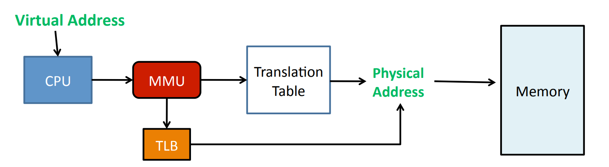
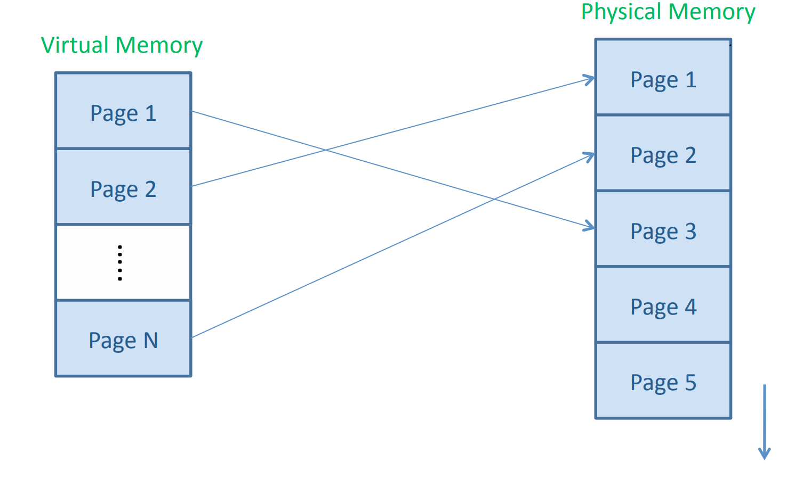
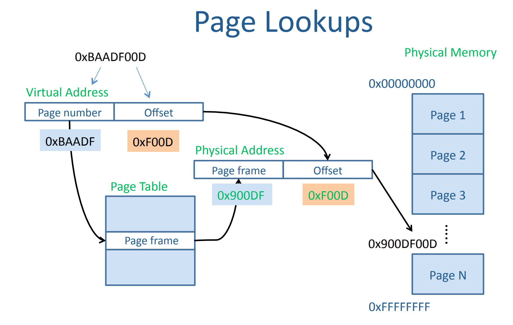

<h1>可行性报告</h1>

- [项目介绍](#项目介绍)
- [理论依据](#理论依据)
  - [使用 Rust 对 C 代码改写的可行性](#使用-rust-对-c-代码改写的可行性)
    - [C 语言指针的改写](#c-语言指针的改写)
    - [C 语言宏定义及条件编译的改写](#c-语言宏定义及条件编译的改写)
  - [FreeRTOS 源码分析](#freertos-源码分析)
    - [总体代码风格](#总体代码风格)
    - [任务](#任务)
    - [消息队列](#消息队列)
    - [信号量](#信号量)
      - [二值信号量](#二值信号量)
      - [计数信号量](#计数信号量)
      - [互斥信号量](#互斥信号量)
      - [递归互斥信号量](#递归互斥信号量)
- [技术依据](#技术依据)
  - [MMU(未完)](#mmu未完)
    - [重要机制\&技术](#重要机制技术)
      - [Paging](#paging)
      - [TLB](#tlb)
  - [可行性分析](#可行性分析)
    - [硬件可行性](#硬件可行性)
    - [软件可行性](#软件可行性)
  - [改写示例](#改写示例)
- [创新点](#创新点)

## 项目介绍
在这个项目中，我们将使用 Rust 语言重新改写 FreeRTOS 操作系统，并使其支持 MMU。

FreeRTOS 是一个热门的嵌入式设备用即时操作系统核心，它于 2003 年由 Richard Barry 设计，并已被经成功移植到 35 种不同的微控制器上。[^1]

在计算机技术日益成熟的今天，C/C++ 语言的弊端也逐渐显现。由于C/C++中大量的操作基于指针实现，所以C/C++ 实现的项目中经常会产生内存安全相关的问题，而这样的问题也会在使用 C 语言编写的 FreeRTOS 中体现。作为一门致力于系统级编程的语言， Rust 语言特有的内存安全性恰恰弥补了这方面的不足，在对内存安全要求极高的操作系统领域有着举足轻重的标志性作用。同时， Rust 的性能与 C/C++ 不相上下，从长期来看，Rust 具有完全取代 C/C++ 的能力，而世界范围内用Rust重写C/C++项目也早已成为非常流行的趋势。

同时，FreeRTOS 本身还存在另一点问题，即不支持内存管理单元（Memory Managing Unit, MMU）。在硬件资源有限的单片机中，内存管理单元显得格外重要。所以，我们mustrust小组的目标就是改写FreeRTOS，使 FreeRTOS 支持内存管理单元，并在单片机上进行实机测试。

在本报告中，我们将依次分析该项目的理论依据（使用 Rust 对 C 代码改写的可行性、对 FreeRTOS 源码的分析）和技术依据（MMU 的分析、使用硬件运行改写后 FreeRTOS 的方案以及对部分代码的改写示例），并提出这个项目中的创新点。

## 理论依据
### 使用 Rust 对 C 代码改写的可行性
下面我们需要针对一些 C 语言中特有的写法，讨论其使用 Rust 改写的可行性。

#### C 语言指针的改写
在调用底层硬件的过程中，我们会无法避免的要使用到指针等不安全代码，而 Rust 中也有其相对应的实现：Unsafe Rust。

Rust 本身执行着非常严格且保守的安全审查，部分代码会因为编译器无法分析出其正确性而被拒绝编译，此时，我们需要使用 `unsafe` 关键字，而我们就需要对这部分 `unsafe` 的代码的安全性负责。同时，`unsafe` 的存在也并不会影响 Rust 本应有的安全性，Rust 中部分对安全的检查在 `unsafe` 块中依然存在。

使用了 `unsafe` 之后，就可以改写 C 语言的指针。下面是一段示例代码：

``` rust
fn main() {
    let a = [1, 1, 4, 5, 1, 4];
    let mut p = &a[1] as *const i32;
    unsafe {
        p = p.add(1);
        println!("The value of p is {}", *p);
    }
}
// The value of p is 4
```

#### C 语言宏定义及条件编译的改写
C 语言的宏和条件编译功能，使得其有非常好的可扩展性，在不同的平台上，只需要在编译器中预定义不同的宏，即可在不需要修改代码的情况下进行跨平台编译。但是，如果宏使用不当，也会造成代码可读性急剧降低的情况，且可能出现其他未预料的情况，比如下面这段代码：

``` c
#include <stdio.h>
#define mul(a, b) a * b

int main() {
    printf("%d\n", mul(1 + 2, 3 + 4)); // 3 * 7 ???
    return 0;
}
// outputs 11 but not 21
```

Rust 中也有宏定义的功能，且与 C 语言的宏相比，Rust 的宏也并不危险，就如上面这段代码，按照其本意改写为 Rust 后如下：

``` rust
macro_rules! mul {
    ($a: expr, $b: expr) => {
        $a * $b
    }
}

fn main() {
    println!("{}", mul!(1 + 2, 3 + 4)); // 21
}
```

代码可以输出正确的结果，而不会像 C 一样输出错误的结果。

对于条件编译的情况，Rust 不需要像 C 一样通过一个 `.h` 文件定义大量的宏来进行编译的配置，而是使用 `Cargo.toml` 文件进行配置，同理也有一些系统配置（如系统类型、位数等）可以直接使用。在代码中，只需要在 if 语句中使用 `cfg!` 宏即可达到条件编译的效果，如下面的代码：

``` rust
fn main() {
    let os = if cfg!(windows) {
        "Windows"
    }
    else if cfg!(unix) {
        "Unix"
    }
    else {
        "Unknown"
    };
    let bit = if cfg!(target_pointer_width = "32") {
        "32-bit"
    }
    else if cfg!(target_pointer_width = "64") {
        "64-bit"
    }
    else {
        "What the fxxk?"
    };
    println!("You are using {} {} operating system.", bit, os);
}
```

可以显示你的系统类型以及位数。

### FreeRTOS 源码分析
#### 总体代码风格
* **宏定义**：代码中使用了大量的宏定义与条件编译，这部分的可行性已于前面进行过分析。
* **函数定义**：由于 C 语言面向过程的特性，无法使用面向对象语言（如 C++）中的命名空间以及类，所以需要使用特殊的函数名称标识出该函数的一些特性。在 FreeRTOS 的源代码中函数名格式为：返回值类型 + 所在文件 + 函数名。
  * 对于非静态函数，“返回值类型”为若干个小写字母，表示函数的返回值类型，对于 void 函数则为 `v`，对于有返回值的函数则为 `x` 或 `ux`（取决于返回值是否无符号）。对于静态函数，“返回值类型”固定为 `prv`。
  * “所在文件”采用大写字母开头，比如函数在 `list.c` 文件中，则“所在文件”为 `List`。
  * “函数名”采用大驼峰命名法。
  * 例如，`uxListRemove` 函数名表示 `list.c` 文件中的 `Remove` 函数，返回值为无符号的类型。
  * 由于 Rust 为面向对象的编程语言，所以命名函数的时候可以只保留函数名部分。
* **变量定义**：变量名的格式为：变量类型 + 变量名。
  * “变量类型”为若干小写字母，用 `l` 表示 long，`s` 表示 short，`c` 表示 char，其余（包括 size_t 等不同系统中长度不固定的类型）用 `x`。前缀 `u` 表示无符号，`p` 表示指针。如 `puc` 表示指向 `unsigned char` 的一个指针。
  * “变量名”采用大驼峰命名法。
* **注释**：代码中不使用 `//` 注释，所有注释均为 `/* ... */` 格式。函数间有一条分隔线作用的注释。

#### 任务
FreeRTOS 的源代码中有一大半都在处理各种任务，下面对 FreeRTOS 的任务系统进行分析。

FreeRTOS 中的任务状态有 5 种：正在运行 `X`、阻塞 `B`、就绪 `R`、删除 `D`、挂起 `S`。含义如下：
+ 正在运行：任务正在运行；
+ 阻塞：任务正在等待某个外部事件，无法正常继续执行；
+ 就绪：任务正在等待资源，当资源充足时开始执行；
+ 删除：任务被删除；
+ 挂起：任务无法继续执行，直到被 Resume。

每个任务还有一个优先级，0 为最低，最高的值在配置文件中，可以自行修改。

下面是任务相关的 API 函数：
+ `xTaskCreate`：创建任务，初始状态为就绪；
+ `xTaskDelete`：删除任务；
+ `xTaskSuspend`：挂起任务，任务进入挂起状态；
+ `xTaskResume`：唤醒任务，任务从挂起状态进入就绪状态。

#### 消息队列
消息队列可以在任务与任务、任务与中断之间传递消息，队列可以保存有限个具有确定长度的数据单元。队列可保存的最大单元数目被称为队列的长度，在队列创建时需要指定其长度和每个单元（队列项或消息）的大小。通常情况下，队列被作为 FIFO（先进先出）使用，即数据由队尾写入，从队首读出。队列在 `queue.c` 中被定义。[^2]

队列有以下的特性：
+ 数据存储：往队列写入数据是通过字节拷贝把数据复制存储到队列中；从队列读出数据使得把队列中的数据拷贝删除。
+ 可被多任务存取：队列不是属于某个特别指定的任务的，任何任务都可以向队列中发送消息，或者从队列中提取消息。
+ 读队列时阻塞：当某个任务试图读一个队列时，其可以指定一个阻塞超时时间。在这段时间中，若队列为空，该任务将保持阻塞状态以等待队列数据有效。当其他任务或中断服务程序往其等待的队列中写入了数据，该任务将自动由阻塞态转移为就绪态。当等待的时间超过了指定的阻塞时间，即使队列中尚无有效数据，任务也会自动由阻塞态转移为就绪态。
+ 写队列时阻塞：任务也可以在写队列时指定一个阻塞超时时间。这个时间是当被写队列已满时，任务进入阻塞态以等待队列空间有效的最长时间。

下面是队列相关的 API 函数：
+ `xQueueGenericCreate` / `xQueueGenericCreateStatic`：创建队列；
+ `xQueueGenericReset`：复位队列；
+ `xQueueGenericSend`：任务级入队；
+ `xQueueGenericSendFromISR`：中断级入队；
+ `xQueueReceive`：任务级出队；
+ `xQueueReceiveFromISR`：中断级出队。

#### 信号量
信号量一般用来进行资源管理和任务同步，FreeRTOS中信号量又分为二值信号量、计数型信号量、互斥信号量和递归互斥信号量。

信号量的实现位于 `semphr.h` 文件中。

##### 二值信号量
二值信号量即任务与中断间或者两个任务间的标志，该标志非满即空。也可以理解为只有一个队列项的队列，该队列要么是满要么是空，Send 操作相当于把该标志置满，Receive 操作相当于把该标志置空，经过 Send 和 Receive 操作实现任务与中断间或者两任务的操作同步。[^3]

可以使用 `xSemaphoreCreateBinary` / `xSemaphoreCreateBinaryStatic` 创建二值信号量。

##### 计数信号量
计数信号量有释放信号量操作和获取信号量操作，释放信号量操作的时候计数器的值会加一，获取信号操作，计数器的值减一，如果减到 0 任务会进入到等待状态。计数信号量可用于事件计数和资源管理。[^4]

可以使用 `xSemaphoreCreateCounting` / `xSemaphoreCreateCountingStatic` 创建计数信号量。

##### 互斥信号量
优先级翻转是使用二值信号量时常遇见的问题，在可剥夺内核中非常常见，但是在实时系统中不允许出现这种现象，因为会破坏任务的预期顺序，可能会导致严重后果。[^5]

当低优先级的任务访问资源的过程中，高优先级的任务到达时，会剥夺低优先级任务的 CPU 使用权运行高优先级任务，但是当高优先级任务想要访问资源时，由于资源仍然被低优先级任务占用着，所以必须等到低优先级任务运行完释放资源时高优先级任务才能继续运行，相当于高优先级任务的优先级降到了低优先级任务的同一等级。此时如果有一个中等优先级的任务在高优先级任务等待的过程中到达，且不需要访问资源，则中等优先级的任务会比高优先级任务更先完成，此时二者的优先级就会翻转。

互斥信号量相当于是一个拥有优先级继承的二值信号量，当互斥信号量被一个低优先级任务使用时，若有高优先级任务尝试获取该信号量则会被阻塞，但是此时高优先级任务会将低优先级任务的优先级提升到自己的等级，可以降低优先级翻转带来的影响。

可以使用 `xSemaphoreCreateMutex` / `xSemaphoreCreateMutexStatic` 创建互斥信号量。

##### 递归互斥信号量
递归互斥信号量是一种特殊的互斥信号量，已经获取了互斥信号量的任务不能再次获取这个互斥信号量，但是递归互斥信号量不同；已经获取了递归互斥信号量的任务可以再次获取这个递归互斥信号量（即可以嵌套使用），且次数不限。递归互斥信号量也有优先级继承的问题。[^6]

可以使用 `xSemaphoreCreateRecursiveMutex` / `xSemaphoreCreateRecursiveMutexStatic` 创建互斥信号量。

## 技术依据

### MMU(未完)

MMU的基本目标：

- MMU将虚拟地址(VA)转换为物理地址(PA)，给上层的程序提供抽象。
- 为进程动态分配内存，同时为内存设立边界
- 在上述基础下通过缓存等机制尽可能提高访存速度

#### 重要机制&技术



##### Paging

分页是把整个虚拟和物理内存空间切成一段段固定尺寸的大小。即划分逻辑地址空间至固定大小的页（Page），划分物理内存空间至固定大小的帧（Frame），并建立方案，转换逻辑地址为物理地址。



使用分页技术时，一个虚拟地址可以通过截断高位分为两部分**虚拟页号**和**页内偏移**。要将一个虚拟地址映射到物理地址，只需要将虚拟页号通过一个**页表**映射到物理页号，并保留页内偏移即可，如下图所示：



**多级页表**

当内存空间较大时，会需要大量内存存储页表。对每个进程来说，这是一笔巨大的开销。通过动态创建的多级页面表，如二级页面表，可以大大减少页表占用的空间，因为只有当需要时，这些二级页面表项才会被创建，这样就优化了空间使用。

**页表中存储的信息**

##### TLB

转译后援缓冲（Translation Lookaside Buffer，TLB）是一种硬件实现，用于加速虚拟地址到物理地址的转换过程。每当进行地址转换时，MMU首先会查看TLB是否有相应的条目。如果有，就直接使用TLB中的信息进行转换，这被称为TLB命中。如果没有，那么就需要通过页表进行查找，并将结果缓存在TLB中，这被称为TLB缺失。

增加更多细节

### 可行性分析

#### 硬件可行性

树莓派的CPU架构（ARM Cortex-A72）具有支持MMU的硬件，这意味着我们可以在FreeRTOS中实现MMU支持。

调查一下arm的手册

#### 软件可行性

这个mmu.c是什么？？ https://github.com/jameswalmsley/FreeRTOS/blob/master/FreeRTOS/Demo/CORTEX_A5_SAMA5D3x_Xplained_IAR/AtmelFiles/libchip_sama5d3x/source/mmu.c


根据之前组的[调查结果](https://github.com/OSH-2023/imagination/blob/main/docs/%E7%BB%93%E9%A2%98%E6%8A%A5%E5%91%8A/%E7%BB%93%E9%A2%98%E6%8A%A5%E5%91%8A.md)，我很不乐观

参考：

MMU Lecture slides(部分内容可以从这个借鉴)
-  https://cseweb.ucsd.edu/classes/su09/cse120/lectures/Lecture7.pdf
-  https://cseweb.ucsd.edu/classes/su09/cse120/lectures/Lecture8.pdf

B乎文章
- https://zhuanlan.zhihu.com/p/549919985

Paging in MMU:
-  "Memory management unit" from Wikipedia. [Link](https://en.wikipedia.org/wiki/Memory_management_unit)
-  "CS 537 Lecture Notes Part 7 Paging" from University of Wisconsin-Madison. [Link](https://pages.cs.wisc.edu/~solomon/cs537-old/last/paging.html)

TLB in MMU:
- "Translation lookaside buffer" from Wikipedia. [Link](https://en.wikipedia.org/wiki/Translation_lookaside_buffer)
- "ARM Cortex-A Series Programmer's Guide for ARMv8-A" from ARM Developer. [Link](https://developer.arm.com/documentation/den0024/latest/The-Memory-Management-Unit/The-Translation-Lookaside-Buffer)
<!-- - "ARMv8-A Memory Management: MMU and TLB Explained" from LinkedIn. [Link](https://www.linkedin.com/advice/3/how-do-you-leverage-memory-management-unit-mmu) -->

MMU support in Raspberry Pi CPU architecture:
- "MMU on Raspberry Pi" from snaums.de. [Link](https://www.snaums.de/informatik/mmu-on-raspberry-pi.html)
- "A Raspberry Pi Operating System for Exploring Advanced..." from University of Maine. [Link](https://web.eece.maine.edu/~vweaver/projects/vmwos/2018_memsys_os.pdf)

MMU support in FreeRTOS:
- "FreeRTOS MMU support - Kernel" from FreeRTOS Forums. [Link](https://forums.freertos.org/t/freertos-mmu-support/10509)
- "Benefits of Using the Memory Protection Unit" from FreeRTOS. [Link](https://www.freertos.org/2021/02/benefits-of-using-the-memory-protection-unit.html)
- "mmu.c" from GitHub repos by James Walmsley. [Link](https://github.com/jameswalmsley/FreeRTOS/blob/master/FreeRTOS/Demo/CORTEX_A5_SAMA5D3x_Xplained_IAR/AtmelFiles/libchip_sama5d3x/source/mmu.c)

### 改写示例

下面我们尝试用Rust来实现链表的基本操作：

首先定义链表的结构，一个双向链表需要一个指向头节点和尾节点的指针，结构体如下：

```rust
pub struct List<T> {
    head: Link<T>,
    tail: Link<T>,
}
```

然后需要定义节点的结构，一个节点需要一个元素值，一个指向前驱节点的指针`pre`和一个指向后继节点的指针`next`，所以可定义结构如下：

```rust
use std::rc::Rc;
use std::cell::RefCell;

type Link<T> = Option<Rc<RefCell<Node<T>>>>;

struct Node<T> {
    elem: T,
    next: Link<T>,
    pre : Link<T>,
}
```

其中`Option<Rc<RefCell<Node<T>>>>` 表示这个 Link 可能存在（Some），也可能不存在（None）。这对于实现链表这样的数据结构是必要的，因为链表的末尾没有下一个节点，所以需要一个表示“没有节点”的值。

`Rc<RefCell<Node<T>>>` 是一个引用计数（Rc）包装的 `RefCell<Node<T>>`。Rc 允许多个所有者共享数据，只有当最后一个 Rc 被丢弃时，数据才会被清理。这对于实现共享所有权的数据结构（如这里的双向链表）是必要的。

`RefCell<Node<T>>` 是一个 RefCell 包装的 `Node`。RefCell 是 Rust 中的一个内部可变性工具，它允许在运行时检查借用规则（而不是在编译时），这对于实现某些数据结构（如这里的双向链表）是必要的。

下面再定义链表的各种方法：

* `new`方法，新建一个双向链表，直接返回一个头指针和尾指针均为空的双向链表即可：

  ```rust
  impl<T> List<T> {
      pub fn new() -> Self {
          List { head: None, tail: None }
      }
  }
  ```

* `push_front`方法，在双向链表的头节点前插入一个节点，节点的元素值为`elem`。

  首先我们需要创建一个节点值为`elem`的新节点，然后检查链表是否存在。这时上面所提到的`Option<Rc<RefCell<Node<T>>>>`就发挥了作用。链表存在时，`self.head.take() == Some`，此时需要将新节点作为链表新的头节点，并将新节点得`next`指向原头节点，原头节点得`pre`指向新节点；不存在时`self.head.take() == None`，此时令链表得头节点和尾节点都为新节点即可。所以可以使用`match`来处理这两种情况：

  ```rust
  pub fn push_front(&mut self, elem: T) {
      let new_head = Node::new(elem);
      match self.head.take() {    
          Some(old_head) => {
              // borrow_mut 作用于RefCell，获取里面的借用并且将其转型为mut
              old_head.borrow_mut().pre  = Some(new_head.clone());
              new_head.borrow_mut().next = Some(old_head);
              self.head = Some(new_head);
          }
          None => {
              self.tail = Some(new_head.clone());
              self.head = Some(new_head);
          }
      }
  }
  ```

  这段代码中的 `borrow_mut`方法用于获取 `RefCell`中的值的可变引用。 `clone`方法用于创建节点的副本。因为我们的链表是双向的，每个节点都有一个到前一个节点的 `pre`指针和一个到下一个节点的 `next`指针。当我们插入新节点时，我们需要创建节点的副本，以便我们可以安全地更新 `pre`和 `next`指针。

* `pop_front`方法，移除双向链表得头节点，并返回这个节点的元素值。这需要根据头节点是否存在来处理，若存在，则移除并取出元素值，若不存在，则返回`None`。但是具体实现较为复杂，代码如下：

  ```rust
  pub fn pop_front(&mut self) -> Option<T> {
      self.head.take().map(|old_head| {
          match old_head.borrow_mut().next.take() {
              Some(new_head) => {
                  new_head.borrow_mut().prev.take();
                  self.head = Some(new_head);
              }
              None => {
                  self.tail.take();
              }
          }
          Rc::try_unwrap(old_head).ok().unwrap().into_inner().elem
      })
  }
  ```

  这里我们首先使用`head.take()`方法取出头节点，然后使用`map`方法来处理头节点存在的情况。然后使用`old_head.borrow_mut().next.take()`取出原来头部节点的下一个节点，并将 `old_head.next` 设置为 `None`。然后根据新的头部节点是否存在，执行不同的代码：

  - 如果新的头部节点存在（即 `Some(new_head)`），则执行以下操作：
    - `new_head.borrow_mut().prev.take()`：将新的头部节点的 `prev` 属性设置为 `None`。
    - `self.head = Some(new_head)`：将新的头部节点设置为链表的头部节点。
  - 如果新的头部节点不存在（即 `None`），则执行 `self.tail.take()`，将链表的尾部节点设置为 `None`。

  最后使用`Rc::try_unwrap(old_head).ok().unwrap().into_inner().elem`取出原来头部节点中的元素。

  而如果头节点不存在，这个表达式就为`None`，也就会返回`None`。

* `peek_front`方法，取出双向链表头节点的元素值，但是并不移除头节点。代码如下

  ```rust
  pub fn peek_front(&self) -> Option<Ref<T>> {
      self.head.as_ref().map(|node| {
          Ref::map(node.borrow(), |node| &node.elem)
      })
  }
  ```

  这里首先使用`self.head.as_ref()`获取链表的头部节点的引用。`as_ref` 方法会将 `Option` 转换为一个引用的 `Option`。然后使用`map`方法处理头部节点存在的情况：使用`Ref::map(node.borrow(), |node| &node.elem)`获取头部节点中的元素的引用。而如果头节点不存在，这个表达式就为`None`，也就会返回`None`。

* `Drop`trait，用于`List<T>` 类型的析构行为，在 `List<T>` 类型的值被丢弃时，连续弹出链表的头部节点，直到链表为空。代码如下：

  ```rust
  impl<T> Drop for List<T> {
      fn drop(&mut self) {
          while self.pop_front().is_some() {}
      }
  }
  ```

  这里在`Drop`实现定义了一个`drop`方法，该方法使用一个`while`循环来不断`pop`头节点直接头节点不存在即链表为空。

关于尾节点的相关方法均类似，这里不再赘述。

## 创新点

我们的项目目标是使用以兼具高安全性和高效率著称的Rust语言来改写世界上最流行的实时操作系统——FreeRTOS，并使其支持MMU。这个项目是已经有前人做过的，但是之前的工作由于硬件使用过于复杂而采取了软件模拟的方式，而我们计划完整地实现这个项目，最后上板验证。所以我们地创新点就在于我们最终会上板而不是使用软件模拟环境，而复杂的硬件结构和工作方式也势必会带来挑战，但我们有信心克服！


[^1]: https://zh.wikipedia.org/wiki/FreeRTOS
[^2]: https://zhuanlan.zhihu.com/p/462666579
[^3]: https://zhuanlan.zhihu.com/p/464194120
[^4]: https://zhuanlan.zhihu.com/p/464196691
[^5]: https://zhuanlan.zhihu.com/p/464566648
[^6]: https://zhuanlan.zhihu.com/p/464568490
