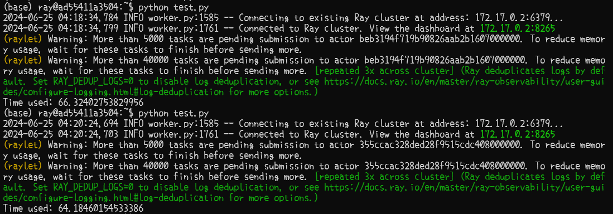
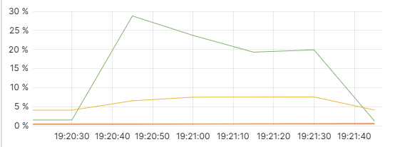
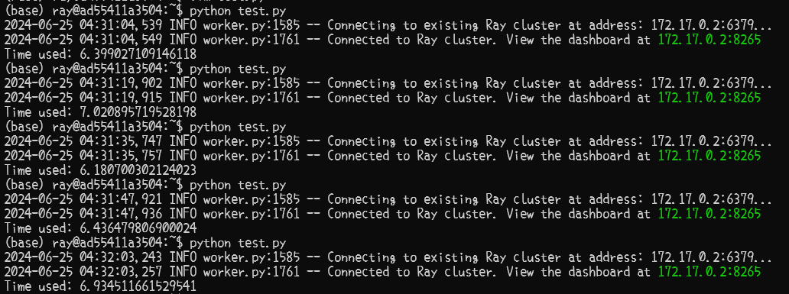
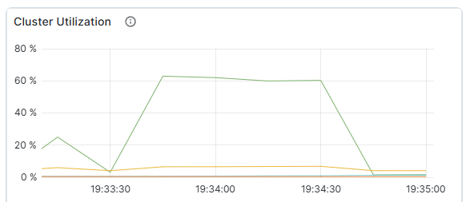
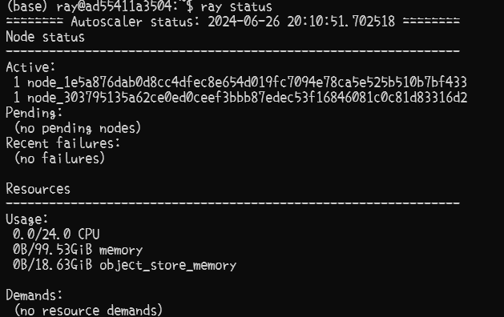
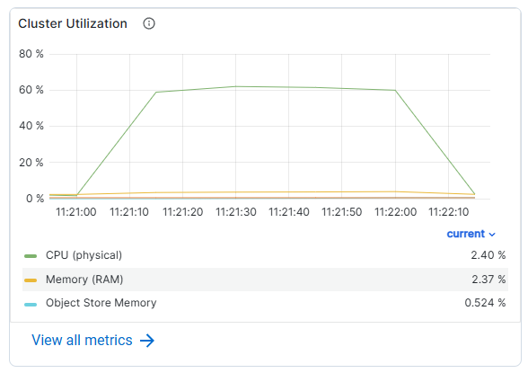
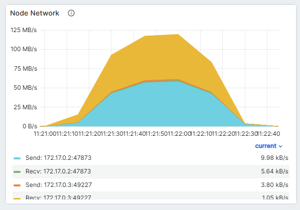

# 性能测试与分析
## 测试任务选定
随着 AI 的发展，深度学习也逐渐融入了我们的日常生活中，而模型的推理也成为了 AI 融入生活时必不可少的一部分。

我们使用 MNIST 数据集进行了最简单的手写数字识别训练，神经网络模型的结构如下：
+ 输入层：大小为 784，即一张 28*28 图片的大小；
+ 第一层隐含层：大小为 448，即 28*16；
+ 第二层隐含层：大小为 160，即 16*10；
+ 输出层：大小为 10，即每一种数字的概率。

每两层之间均为全连接层，即参数的数量达到了 425130 个。

现在训练已经完成，下面需要使用大小为 100000 的测试数据集，在该神经网络上进行测试，并得到 100000 个长度为 10 的输出结果向量。

我们对这个过程进行简化，本次的实验内容为测试效率，模型的参数以及数据集中的具体数据不重要，我们使用随机的参数和随机的数据集进行测试。

## 测试性能指标
+ 吞吐率：系统在单位时间内能够处理的任务数量；
+ 延迟：单任务从提交至系统到处理完成所耗费的时间；
+ 资源使用率：系统运行任务时 CPU、GPU、内存等硬件的占用率；
+ IO 使用率：系统运行任务时 IO 和网络的吞吐率；
+ 稳定性：系统执行任务的成功率。

在分布式计算中，吞吐率是最重要的性能指标，所以我们将其作为测试指标。由于本次任务为 CPU 密集型任务，CPU 使用率越高，说明任务的调度更加高效，执行效率也就更高。综上，我们将**吞吐率**和**CPU 使用率**作为测试指标。

测试所用的电脑为 12 核 CPU，内存 128GB。

## 性能测试
### 单机部署
对未优化的程序进行测试，吞吐率如下：

| 测试编号 | 用时 / s | 吞吐率 / TPS |
| -------- | -------- | ------------ |
| 1        | 66.324   | 1507.750     |
| 2        | 64.185   | 1557.996     |
| 3        | 65.694   | 1522.209     |
| 4        | 66.445   | 1505.004     |
| 5        | 66.547   | 1502.697     |
| 平均     | 65.839   | 1519.131     |



选取其中一次测试，查看其 CPU 占用如下：



CPU 占用不到 30%，还存在非常大的优化空间。

### 单机优化

我们发现，由于只有一个神经网络类，所以只启动了一个 Actor，目前所有的任务都只发到了一个 Actor 上，所以我们将神经网络进一步包装为一个类 Actor，然后定义若干个这个类，这样就可以启动多个 Actor 进行并行，提高效率。

另外，我们每一次只提交一个任务，而这个任务大多数时候很快就被计算完了，此时大量的时间就会浪费在提交的过程中。所以，我们将多个任务分为一组提交，减少浪费在提交过程中的时间。

我们按照 10 个 Actor、每组 10 个任务进行测试，吞吐率如下：

| 测试编号 | 用时 / s | 吞吐率 / TPS |
| -------- | -------- | ------------ |
| 1        | 6.399    | 15627.44     |
| 2        | 7.021    | 14242.99     |
| 3        | 6.181    | 16178.61     |
| 4        | 6.436    | 15537.60     |
| 5        | 6.935    | 14419.61     |
| 平均     | 6.594    | 15201.25     |



由于上述测试中每次运行的时间很短，难以获得准确的 CPU 占用，我们将任务总量提升至 1000000，运行并测试 CPU 占用：



可以看到 CPU 占用达到甚至超过了 60%。

相比于优化之前，吞吐率提升了 900% 左右，CPU 占用提升了 200% 以上。

### 分布式部署

启动两个 docker 容器，并让第二个容器作为从节点连接第一个容器。在第一个容器中输入 `ray status`，可以看到出现了两个 Active node：



以 10 个 Actor、每组 10 个任务进行测试，吞吐率如下：

| 测试编号 | 用时 / s | 吞吐率 / TPS |
| -------- | -------- | ------------ |
| 1        | 7.125    | 14035.09     |
| 2        | 7.707    | 12975.22     |
| 3        | 6.415    | 15588.46     |
| 4        | 6.727    | 14865.47     |
| 5        | 6.142    | 16281.34     |
| 平均     | 6.823    | 14749.12     |

下面将任务量调整至 1000000，测试 CPU 占用：



可以看到，分布式计算的吞吐率较单机有所下降，CPU 占用也相比单机有少量下降，分析下降的原因，两个节点都是在本机运行的，所以 CPU 以及其他硬件配置上没有差别，则原因只能是两个节点之间进行数据传输带来的开销较大。查看硬件占用中的网络占用，可以看到，在运行的过程中，网络占用最高达到了 125MB/s：



所以，如果数据量更大，或者分布式计算的网络环境更差时（如节点分布在不同机器上，机器间仅靠无线网络连接），节点之间的通信将会成为效率瓶颈。

## 附：测试所用代码

```py
import ray
import numpy as np
import time

# Define the ReLU function
relu = lambda x: np.maximum(0, x)

# A Random-parameter Neural Network
class fake_NN:
    def __init__(self):
        self.W1 = np.random.rand(784, 448)
        self.B1 = np.random.rand(448)
        self.W2 = np.random.rand(448, 160)
        self.B2 = np.random.rand(160)
        self.W3 = np.random.rand(160, 10)
        self.B3 = np.random.rand(10)
    
    def forward(self, input):
        x = relu(input @ self.W1 + self.B1)
        x = relu(x @ self.W2 + self.B2)
        x = x @ self.W3 + self.B3
        return x
    
    def forwards(self, inputs):
        result = []
        for input in inputs:
            result.append(self.forward(input))
        return result

# Ray Distributed Actor
@ray.remote
class Actor:
    def __init__(self):
        self.model = fake_NN()
    
    def predict(self, inputs):
        return self.model.forward(inputs)


ray.init(address='auto', dashboard_host="0.0.0.0")
task_num = 100000
batch_size = 10

start_timer = time.time()

# initialize actors
actor_num = 10
actors = [Actor.remote() for _ in range(actor_num)]

tasks = []
for i in range(task_num // batch_size):
    inputs = [np.random.rand(784) for _ in range(batch_size)]
    tasks.append(actors[i % actor_num].predict.remote(inputs))

results = ray.get(tasks)

print(f"Time used: {time.time() - start_timer}")
```

